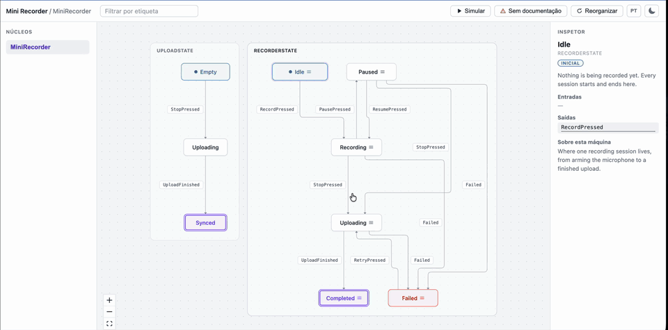

# crux_analyzer

Semantic analyzer for **Rust + Crux** applications: turns the code into living
documentation. The parser (Rust, via `syn`) produces an **intermediate model**;
every client — the web UI, the CLI doc generators, the VS Code extension —
consumes only that model through the JSON Schema contract.

**Full documentation: [docs/](docs/README.md)** — architecture, parser
semantics, schema reference, CLI, web UI, internationalization, development
guide, and [example output](docs/examples/mini-recorder.md) generated by the CLI
itself. Também disponível em [Português (Brasil)](docs/pt-BR/README.md).

The UI and the generated docs speak English and Brazilian Portuguese
(`--locale en|pt-BR`, plus a toggle in the web toolbar) — see
[docs/i18n.md](docs/i18n.md).

## Demo

**Try it live: [josecleiton.github.io/crux_analyzer](https://josecleiton.github.io/crux_analyzer/)**
— the fixture below, analyzed by CI's freshly built analyzer and published on
every push to `main`.



Nothing in that recording was authored by hand. It is the web UI on
[crates/parser/fixtures/mini_recorder/](crates/parser/fixtures/mini_recorder/),
the same fixture [mini_recorder.rs](crates/parser/tests/mini_recorder.rs)
asserts against — so every state, transition, event, effect and description
you see is what the parser extracted from that Rust source:

- the **two orthogonal regions** (`RecorderState`, `UploadState`) found by
  assignment analysis, each rendered as its own section;
- the **inspector** on a selected state — its incoming/outgoing events, the
  effects requested on entry (`AudioOperation::Stop`), and the `///`
  documentation the fixture itself wrote;
- a **simulation** walking `Idle → Recording → Paused → Recording →
  Uploading → Failed → Uploading → Completed`, with the graph highlighting the
  current state and last transition, until a `FINAL` state offers no events;
- the **tag filter** (`retryable`, a `@tag` declared in a doc comment), the
  undocumented-states highlight, and the locale and theme toggles.

Reproduce it against the same fixture, no Crux app needed:

```sh
just model crates/parser/fixtures/mini_recorder "Mini Recorder"
just dev
```

Or read the CLI's take on that same input in
[docs/examples/mini-recorder.md](docs/examples/mini-recorder.md).

## Structure

```
apps/web/        React + TypeScript + React Flow + ELKJS — visualization + simulation
apps/vscode/     VS Code extension: the web UI in a panel, regenerating on save
crates/parser/   Rust lib: walks the syn AST and extracts states/transitions/effects
crates/docgen/   Rust lib: Mermaid + Markdown generators (consume only the model)
crates/cli/      `crux-analyzer` binary: generate | docs, with --watch
crates/i18n/     Rust lib: the shared `Locale` type + detection (no catalogs)
crates/model/    Rust lib: semantic structs (Project, Core, Machine, State, ...)
shared/schema/   JSON Schema contract — every client depends ONLY on this
```

UI data flow (layers):

```
Parser JSON → Domain Model → React Flow Model → Components
                    ↘ Simulation Engine (pure, drives the graph via props)
```

## What the parser understands

The parser never depends on Crux — it analyzes sources statically:

- Cores: `impl App for X`; events via the `Event` associated type, following
  nested event enums and import aliases; effects via the `Effect` closure.
- State machines by assignment analysis (no naming convention): every
  `(enum, field)` written in the code becomes a machine — statechart-style
  orthogonal regions, rendered as sections in the UI.
- Source states from `matches!` guards, `match`-on-state arms (wildcards
  resolve to the complement of earlier arms), `==`/`!=` comparisons (also
  inside `find(|d| ...)` closures, `if let` and `let-else`), and predicate
  methods on the state enum (resolved from their bodies, negation included).
- Targets from direct variant assignments and `T::default()` struct resets
  (landing on the `#[default]` variant).
- Transitions with no state evidence fire from any state (`"*"` in the
  contract); unresolvable evidence and runtime-value targets are reported as
  warnings instead of being silently dropped.
- Effects per transition: the operations each event arm requests
  (`AudioOperation::Start`, crux `render()` → `Render`, ...).
- Documentation the app already wrote: `///` on a state enum becomes the
  machine's description and each variant's becomes its state's, with
  `@failure` / `@deprecated` / `@tag <name>` lines inside them read as declared
  markers. Author prose is carried verbatim and never translated.

## Running

With [`just`](https://just.systems) (see the [Justfile](Justfile) for every recipe):

```sh
just model path/to/app/src MyApp   # analyze a Crux app and feed the UI
just dev                           # web app: graph sections, inspector, simulation
just docs path/to/app/src MyApp    # Markdown docs (or: ... mermaid)
just docs path/to/app/src MyApp markdown pt-BR   # ...in Portuguese
just check                         # full validation: Rust + clippy + web
```

Raw equivalents:

```sh
# Analyze a Crux app and feed the UI (add --watch for living docs)
cargo run -p crux-analyzer-cli -- generate \
  --src path/to/app/src --name MyApp --out apps/web/public/model.json

# Generate documentation
cargo run -p crux-analyzer-cli -- docs --src path/to/app/src            # Markdown
cargo run -p crux-analyzer-cli -- docs --src path/to/app/src --format mermaid

# UI — shows the generated model, or the bundled fake example without one
pnpm install
pnpm dev            # web app (Vite)
pnpm test           # mapping layers + simulation engine

# Crates
cargo check
cargo test          # parser unit + fixture + docgen tests
APP_SRC=path/to/app/shared/src cargo test  # + a local target-app test, if you wrote one
```

## Simulation

Select a state (optional) and hit **Simulate**: the right panel shows the
events that can fire from the current state, firing them walks the machine —
the graph highlights the current state and the last transition taken.

## License

MIT — see [LICENSE](LICENSE).

Third-party dependencies keep their own licenses, and every artifact ships their
notices: **[THIRD-PARTY-NOTICES.md](THIRD-PARTY-NOTICES.md)** is generated from
what each artifact actually contains — regenerate it with `just notices`, and
`just check` fails if it is out of date.

Everything is permissive (MIT / ISC / BSD-3-Clause / CC0 / Unicode-3.0) except
[elkjs](https://github.com/kieler/elkjs), used unmodified for graph layout, which
is available under `EPL-2.0 OR GPL-3.0-or-later` — this project **elects the
EPL-2.0** and emits elkjs as its own bundle chunk. This imposes nothing on your
use of crux_analyzer: EPL-2.0 is file-level weak copyleft and crux_analyzer only
calls ELK's API.
