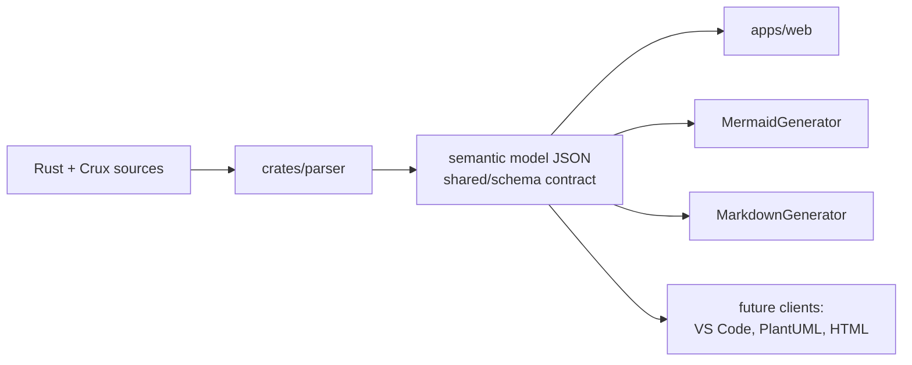
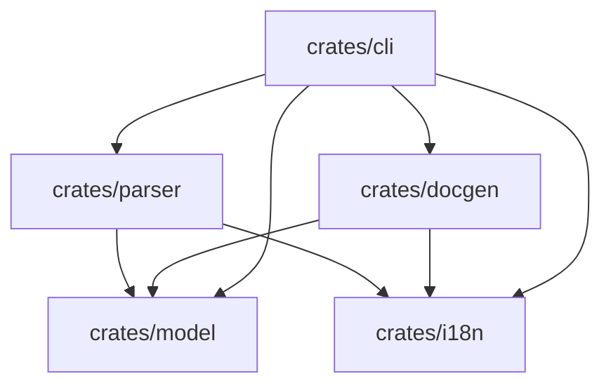

# Architecture

> 🌐 **English** · [Português (Brasil)](pt-BR/architecture.md)

## Monorepo layout

```
crux_analyzer/
  apps/
    web/          React + TypeScript + React Flow + ELKJS — visualization + simulation
  crates/
    parser/       Rust lib: walks the syn AST, extracts Cores/machines/transitions/effects
    docgen/       Rust lib: Mermaid + Markdown generators
    cli/          `crux-analyzer` binary: generate | docs, both with --watch
    i18n/         Rust lib: the shared `Locale` type + detection — no messages
    model/        Rust lib: semantic structs only — no parsing, no UI logic
  shared/
    schema/       JSON Schema contract — every client depends ONLY on this
```

## The model-first design

The project is a semantic analyzer, not a diagram generator. The parser emits
an **intermediate model** (see [schema.md](schema.md)); every client consumes
only that model:



Consequences:

- The parser never knows about React; generators and the UI never see the AST.
- Swapping the parser (or feeding a hand-written JSON) requires zero client
  changes — the web UI ran on a fake JSON for its whole MVP phase.
- New output formats are additive: `crates/docgen` modules take a
  `crux_analyzer_model::Project` and return text.
- crux_analyzer does **not** depend on Crux. It only analyzes source code.

## Hard rules

These are the non-negotiable constraints the codebase is built around
(enforced by layering, checked in review):

1. **Contract isolation (web)** — `apps/web/src/schema/` is the only UI layer
   that knows the raw parser format. Everything else consumes the domain
   model.
2. **Layered UI data flow** —
   `Parser JSON → Domain Model → React Flow Model → Components`.
3. **Geometry belongs to the LayoutEngine** — node positions AND edge routes
   and label boxes are computed by `apps/web/src/layout/` (ELK today).
   Swapping the layout algorithm touches only that directory.
4. **The Graph is a pure renderer** — driven entirely by props (nodes, edges,
   selection, highlights). The Simulation Engine was added without changing
   a line of the Graph component; that is the litmus test for rule 4.
5. **Honesty rule (parser)** — whatever cannot be inferred statically is
   surfaced as a `Warning`, never silently dropped and never guessed. Reading
   what the source *declares* is not guessing: doc comments and their
   `@failure` / `@deprecated` / `@tag` annotations are evidence and travel in
   the model, while name-shaped inferences stay in the clients that want them
   (`domain/stateRole.ts`). See
   [parser.md](parser.md#documentation-and-annotations).
6. **Localization is a presentation concern** — `crates/model`, the parser's
   extraction, and the web app's `domain/` / `flow/` / `layout/` layers hold no
   translated text. Diagnostics travel as data (`WarningKind`) and generators
   take a locale; translated chrome is injected at the boundary (component
   props, `Labels`, `FlowLabels`). The model JSON stays locale-independent: it
   holds no text **of ours**, and identifiers and author prose read out of the
   analyzed app are never translated. See [i18n.md](i18n.md).

## Web app layering

```mermaid
flowchart TD
    json["/model.json (CLI output)\nor bundled example"] --> schema[schema/parserJson.ts\nvalidation + raw types]
    schema --> domain[domain/\nids, incoming/outgoing, machines]
    domain --> flow[flow/toFlowModel.ts\nnodes, edges, group sections]
    flow --> layout[layout/ElkLayoutEngine\npositions + edge routes + label boxes]
    layout --> graph[components/Graph\npure renderer]
    domain --> sim[simulation/engine.ts\npure replay logic]
    sim -->|highlight props| graph
    domain --> inspector[components/Inspector]
    domain --> sidebar[components/Sidebar\noutline + visibility]
    sidebar -->|hidden state ids| flow
```

## Statechart semantics

The model follows David Harel's statecharts on two axes:

- **Orthogonal regions** ("modules"): each Core has `machines[]`, one per
  state enum found in its model. They render as titled sections in the UI
  and as separate diagrams in generated docs.
- **Composite (hierarchical) states**: a variant wrapping a sub-state enum
  (`State::Active(ActiveState)`) expands into `Active/Loading`,
  `Active/Ready`, ... leaf paths — when the code shows evidence of treating
  the inner enum as sub-states (see [parser.md](parser.md#composite-states)).

## Crate dependency graph



`crates/model` sits at the bottom and contains only serde structs matching
the schema; a round-trip test against the bundled example keeps them aligned.

`crates/i18n` sits beside it and holds only the `Locale` type — every crate
keeps the catalog for its *own* strings, so the graph stays a fan-in with no
crate depending on another's message set.
