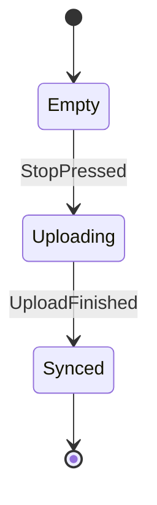

# Mini Recorder

## Core: MiniRecorder

### Machine: RecorderState

Where one recording session lives, from arming the microphone to a
finished upload.

```mermaid
stateDiagram-v2
    Idle --> Recording: RecordPressed / AudioOperation::Start
    Recording --> Paused: PausePressed
    Paused --> Recording: ResumePressed
    Recording --> Uploading: StopPressed / AudioOperation::Stop, HttpOperation::Upload?
    Paused --> Uploading: StopPressed / AudioOperation::Stop, HttpOperation::Upload?
    Uploading --> Completed: UploadFinished
    Failed --> Uploading: RetryPressed / HttpOperation::Upload
    Failed --> Idle: RetryPressed / Render
    Recording --> Failed: Failed
    Paused --> Failed: Failed
    Uploading --> Failed: Failed
    [*] --> Idle
    Completed --> [*]
    note right of Idle : Nothing is being recorded yet. Every session starts and ends here.
    note right of Recording : Capturing audio from the microphone.
    note right of Paused : Capture is suspended and the buffer is kept.
    note right of Uploading : The finished take is on its way to the server.
    note right of Completed : The take is stored and the session is done.
    note right of Failed : The upload gave up. The session is kept so it can be sent again.
```

#### States

| State | Role | Description | Markers | Tags |
| --- | --- | --- | --- | --- |
| Idle | initial | Nothing is being recorded yet. Every session starts and ends here. | — | — |
| Recording | — | Capturing audio from the microphone. | — | — |
| Paused | — | Capture is suspended and the buffer is kept. | — | — |
| Uploading | — | The finished take is on its way to the server. | — | — |
| Completed | final | The take is stored and the session is done. | — | — |
| Failed | — | The upload gave up. The session is kept so it can be sent again. | failure | `retryable` |

##### Paused

Capture is suspended and the buffer is kept.

`by_system` distinguishes a pause the user asked for from one an
interruption forced.

| From | Event | To | Effects |
| --- | --- | --- | --- |
| Idle | `RecordPressed` | Recording | `AudioOperation::Start` → `CaptureStarted` |
| Recording | `PausePressed` | Paused | — |
| Paused | `ResumePressed` | Recording | — |
| Recording | `StopPressed` | Uploading | `AudioOperation::Stop`, `HttpOperation::Upload` → `UploadFinished` (conditional) |
| Paused | `StopPressed` | Uploading | `AudioOperation::Stop`, `HttpOperation::Upload` → `UploadFinished` (conditional) |
| Uploading | `UploadFinished` | Completed | — |
| Failed | `RetryPressed` | Uploading | `HttpOperation::Upload` → `UploadFinished` |
| Failed | `RetryPressed` | Idle | `Render` |
| Recording | `Failed` | Failed | — |
| Paused | `Failed` | Failed | — |
| Uploading | `Failed` | Failed | — |

### Machine: UploadState

Mirrors the finished take to the server.

Being folded into `RecorderState`, which already tracks the upload.

**Markers:** deprecated



| From | Event | To | Effects |
| --- | --- | --- | --- |
| Empty | `StopPressed` | Uploading | — |
| Uploading | `UploadFinished` | Synced | — |

### Capabilities

| Capability | Operations | Answers with |
| --- | --- | --- |
| `Audio` | `AudioOperation::Start`, `AudioOperation::Stop` | `CaptureStarted` |
| `Http` | `HttpOperation::Upload` | `UploadFinished` |

### Events

| Event | Description |
| --- | --- |
| `CaptureStarted` | The shell confirmed the microphone is live. Nothing to decide: the session is already recording. |
| `RecordPressed` | The user hit the record button on the main screen. |
| `RetryPressed` | Retry the failed upload, keeping the recorded take. |

### Effects

| Effect | Description |
| --- | --- |
| `AudioOperation::Start` | Arms the microphone and begins capturing into the session buffer. |
| `HttpOperation::Upload` | Sends the finished take, answering with the server's verdict. |
