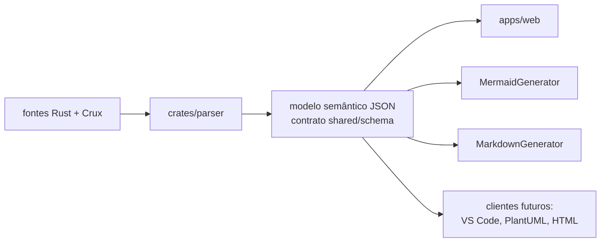
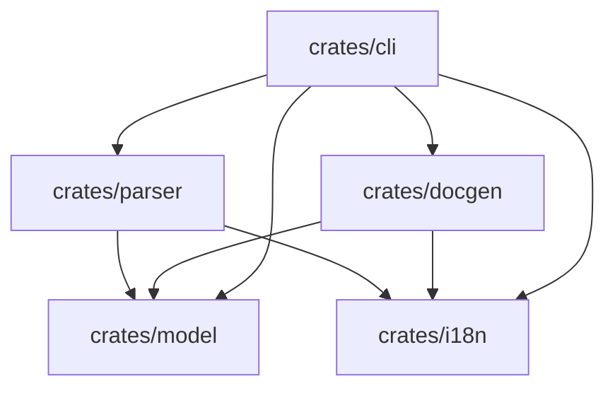

# Arquitetura

> 🌐 [English](../architecture.md) · **Português (Brasil)**

## Layout do monorepo

```
crux_analyzer/
  apps/
    web/          React + TypeScript + React Flow + ELKJS — visualização + simulação
  crates/
    parser/       lib Rust: percorre a AST do syn, extrai Cores/máquinas/transições/efeitos
    docgen/       lib Rust: geradores Mermaid + Markdown
    cli/          binário `crux-analyzer`: generate | docs, ambos com --watch
    i18n/         lib Rust: o tipo `Locale` compartilhado + detecção — sem mensagens
    model/        lib Rust: apenas structs semânticas — sem parsing, sem lógica de UI
  shared/
    schema/       contrato JSON Schema — todo cliente depende SOMENTE dele
```

## O design orientado a modelo

O projeto é um analisador semântico, não um gerador de diagramas. O parser emite
um **modelo intermediário** (veja [schema.md](schema.md)); todo cliente consome
apenas esse modelo:



Consequências:

- O parser nunca sabe da existência do React; geradores e a UI nunca veem a AST.
- Trocar o parser (ou alimentar um JSON escrito à mão) exige zero mudanças nos
  clientes — a UI web rodou sobre um JSON falso durante toda a fase de MVP.
- Novos formatos de saída são aditivos: os módulos de `crates/docgen` recebem um
  `crux_analyzer_model::Project` e devolvem texto.
- O crux_analyzer **não** depende do Crux. Ele apenas analisa código-fonte.

## Regras rígidas

Estas são as restrições não negociáveis em torno das quais a base de código foi
construída (garantidas por camadas, verificadas em revisão):

1. **Isolamento do contrato (web)** — `apps/web/src/schema/` é a única camada da
   UI que conhece o formato bruto do parser. Todo o resto consome o modelo de
   domínio.
2. **Fluxo de dados em camadas na UI** —
   `JSON do parser → Modelo de Domínio → Modelo do React Flow → Componentes`.
3. **A geometria pertence ao LayoutEngine** — posições dos nós E rotas das
   arestas e caixas de rótulo são calculadas por `apps/web/src/layout/` (ELK
   hoje). Trocar o algoritmo de layout mexe somente nesse diretório.
4. **O Graph é um renderizador puro** — dirigido inteiramente por props (nós,
   arestas, seleção, destaques). O Motor de Simulação foi adicionado sem alterar
   uma linha do componente Graph; esse é o teste decisivo da regra 4.
5. **Regra da honestidade (parser)** — o que não pode ser inferido estaticamente
   é exposto como um `Warning`, nunca descartado em silêncio e nunca adivinhado.
   Ler o que a fonte *declara* não é adivinhar: comentários de documentação e
   suas anotações `@failure` / `@deprecated` / `@tag` são evidência e viajam no
   modelo, enquanto inferências baseadas em nomes ficam nos clientes que as
   quiserem (`domain/stateRole.ts`). Veja
   [parser.md](parser.md#documentação-e-anotações).
6. **Localização é uma preocupação de apresentação** — `crates/model`, a extração
   do parser e as camadas `domain/` / `flow/` / `layout/` da aplicação web não
   guardam texto traduzido. Diagnósticos viajam como dados (`WarningKind`) e os
   geradores recebem um locale; o texto traduzido é injetado na fronteira (props
   de componentes, `Labels`, `FlowLabels`). O modelo JSON permanece independente
   de locale: ele não guarda texto **nosso**, e identificadores e prosa do autor
   lidos da aplicação analisada nunca são traduzidos. Veja [i18n.md](i18n.md).

## Camadas da aplicação web

```mermaid
flowchart TD
    json["/model.json (saída da CLI)\nou exemplo embutido"] --> schema[schema/parserJson.ts\nvalidação + tipos brutos]
    schema --> domain[domain/\nids, entradas/saídas, máquinas]
    domain --> flow[flow/toFlowModel.ts\nnós, arestas, seções de grupo]
    flow --> layout[layout/ElkLayoutEngine\nposições + rotas + caixas de rótulo]
    layout --> graph[components/Graph\nrenderizador puro]
    domain --> sim[simulation/engine.ts\nlógica de replay pura]
    sim -->|props de destaque| graph
    domain --> inspector[components/Inspector]
    domain --> sidebar[components/Sidebar\nsumário + visibilidade]
    sidebar -->|ids de estados ocultos| flow
```

## Semântica de statecharts

O modelo segue os statecharts de David Harel em dois eixos:

- **Regiões ortogonais** ("módulos"): cada Core tem `machines[]`, uma por enum de
  estado encontrado em seu modelo. Elas são renderizadas como seções tituladas na
  UI e como diagramas separados na documentação gerada.
- **Estados compostos (hierárquicos)**: uma variante que envolve um enum de
  subestado (`State::Active(ActiveState)`) se expande nas folhas
  `Active/Loading`, `Active/Ready`, ... — quando o código dá evidência de tratar
  o enum interno como subestados (veja
  [parser.md](parser.md#estados-compostos)).

## Grafo de dependências dos crates



`crates/model` fica na base e contém apenas structs serde correspondentes ao
schema; um teste de ida e volta contra o exemplo embutido os mantém alinhados.

`crates/i18n` fica ao lado dele e contém apenas o tipo `Locale` — cada crate
mantém o catálogo das *suas próprias* strings, então o grafo continua sendo um
funil sem nenhum crate dependendo do conjunto de mensagens de outro.
