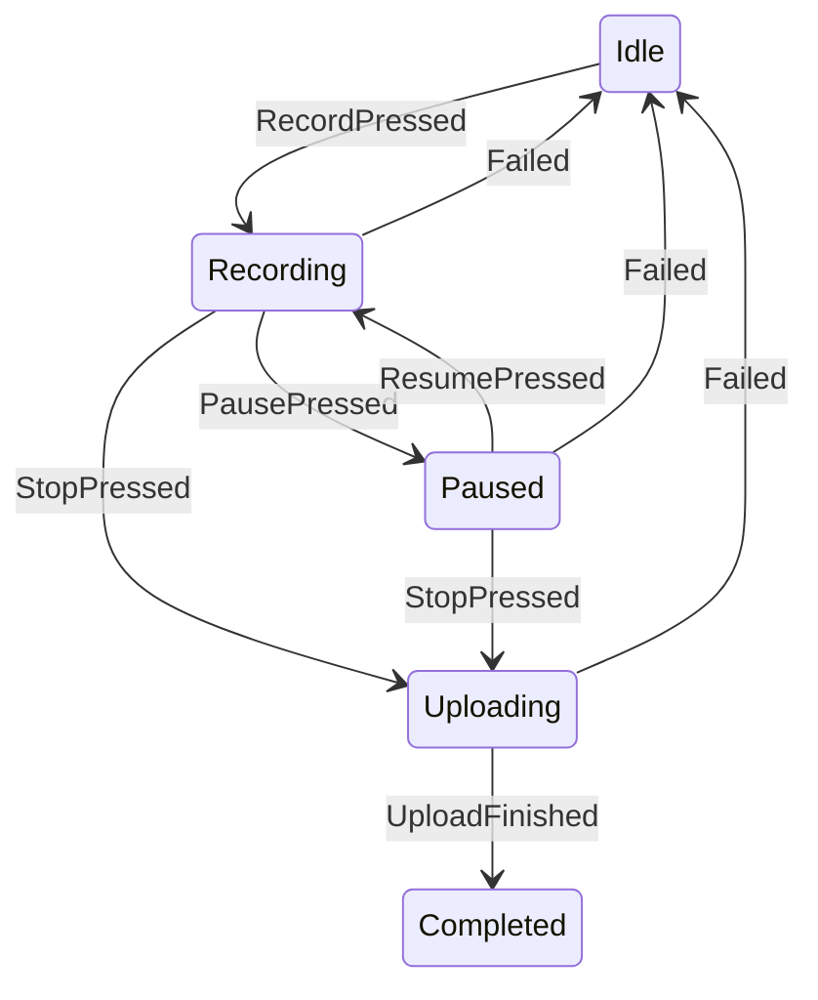
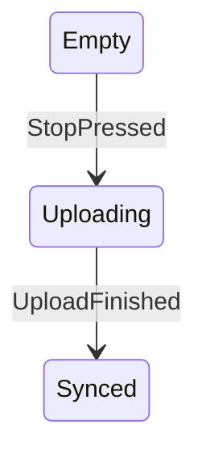

# Mini Recorder

## Núcleo: MiniRecorder

### Máquina: RecorderState

| De | Evento | Para | Efeitos |
| --- | --- | --- | --- |
| Idle | `RecordPressed` | Recording | — |
| Recording | `PausePressed` | Paused | — |
| Paused | `ResumePressed` | Recording | — |
| Recording | `StopPressed` | Uploading | — |
| Paused | `StopPressed` | Uploading | — |
| Uploading | `UploadFinished` | Completed | — |
| Recording | `Failed` | Idle | — |
| Paused | `Failed` | Idle | — |
| Uploading | `Failed` | Idle | — |

### Máquina: UploadState

| De | Evento | Para | Efeitos |
| --- | --- | --- | --- |
| Empty | `StopPressed` | Uploading | — |
| Uploading | `UploadFinished` | Synced | — |
