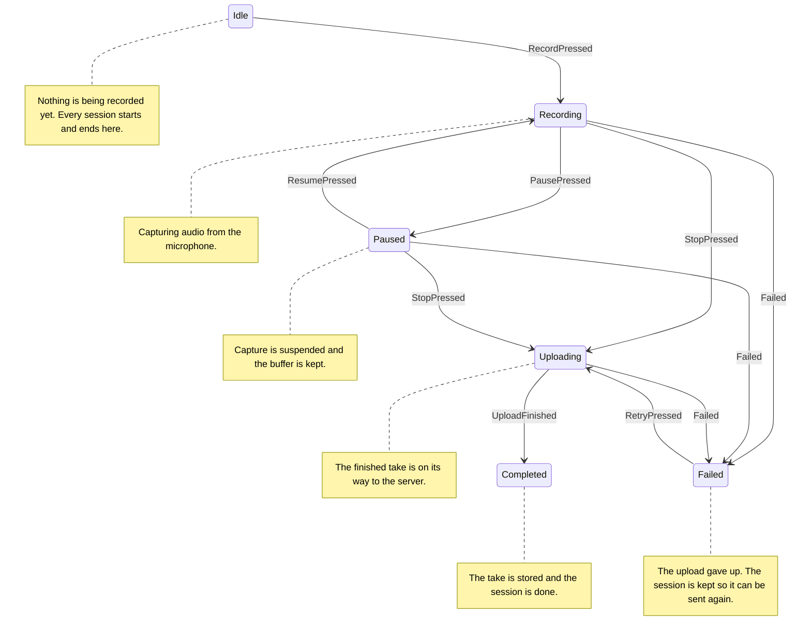
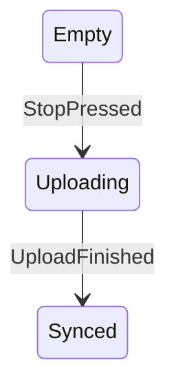

# Mini Recorder

## Núcleo: MiniRecorder

### Máquina: RecorderState

Where one recording session lives, from arming the microphone to a
finished upload.

#### Estados

| Estado | Descrição | Marcadores | Etiquetas |
| --- | --- | --- | --- |
| Idle | Nothing is being recorded yet. Every session starts and ends here. | — | — |
| Recording | Capturing audio from the microphone. | — | — |
| Paused | Capture is suspended and the buffer is kept. | — | — |
| Uploading | The finished take is on its way to the server. | — | — |
| Completed | The take is stored and the session is done. | — | — |
| Failed | The upload gave up. The session is kept so it can be sent again. | falha | `retryable` |

##### Paused

Capture is suspended and the buffer is kept.

`by_system` distinguishes a pause the user asked for from one an
interruption forced.

| De | Evento | Para | Efeitos |
| --- | --- | --- | --- |
| Idle | `RecordPressed` | Recording | — |
| Recording | `PausePressed` | Paused | — |
| Paused | `ResumePressed` | Recording | — |
| Recording | `StopPressed` | Uploading | — |
| Paused | `StopPressed` | Uploading | — |
| Uploading | `UploadFinished` | Completed | — |
| Failed | `RetryPressed` | Uploading | — |
| Recording | `Failed` | Failed | — |
| Paused | `Failed` | Failed | — |
| Uploading | `Failed` | Failed | — |

### Máquina: UploadState

Mirrors the finished take to the server.

Being folded into `RecorderState`, which already tracks the upload.

**Marcadores:** descontinuado

| De | Evento | Para | Efeitos |
| --- | --- | --- | --- |
| Empty | `StopPressed` | Uploading | — |
| Uploading | `UploadFinished` | Synced | — |
